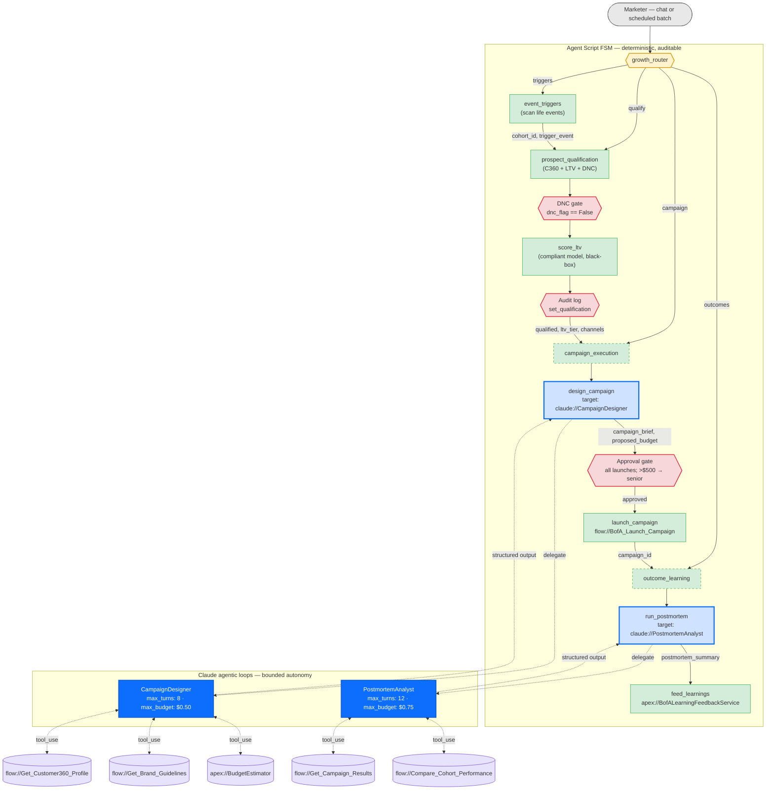

# Agentic Nodes for Agent Script
### Bringing Claude's multi-step reasoning into Agentforce — without giving up determinism

---

## The idea in one paragraph

Agent Script gives you a deterministic, auditable finite-state machine — exactly what regulated enterprises need for compliance gates, approval workflows, and audit trails. But some work doesn't fit a single prompt: designing a personalized campaign, running a post-mortem, synthesizing a research brief. Those need iteration — pull data, draft, check, revise. Today you squeeze that into one `prompt://` call and hope. **Agentic Nodes** add a new top-level block, `claude <Name>:`, that defines a bounded Claude reasoning loop the FSM can route to or delegate into — typed inputs in, typed outputs out. The guardrails stay deterministic. The reasoning gets dramatically better.

> **The selection heuristic:** convert a node when the work is *creative or analytical* and quality improves with iteration. Keep it deterministic when the work is a *decision of record* that must be reproducible for audit.
>
> **Recommended v1 for BofA:** convert `design_campaign` and `run_postmortem`. Leave qualification, gates, and launch exactly as they are.

---

## Case study: BofA Growth Engine

An internal marketer-facing agent that runs the consumer-acquisition funnel end to end:



| | |
|---|---|
| **Green** — deterministic Agent Script | Stays exactly as written today. |
| **Red hexagons** — compliance gates | Do-not-contact (DNC) check, audit log, approval, launch. Never delegated. Hard-enforced by the FSM. |
| **Blue** — `claude://` agentic nodes | The two steps that benefit from iteration. Typed inputs in, typed outputs out, bounded turns and budget. |
| **Purple** — Flows/Apex as tools | The same Salesforce metadata you already have, exposed to the loop as callable tools. |

---

## Primitive mapping — SDK is the source of truth

A `claude <Name>:` block is Agent Script **surface syntax for a Claude Agent SDK `AgentDefinition`**. The SDK defines what the node can do; Agent Script exposes a subset of that to authors and lets the Agentforce runtime manage the rest. The tables below start from each SDK type and show where (or whether) it surfaces in the `.agent` file.

### `AgentDefinition` — the `claude <Name>:` block itself

| SDK field | Description | Agent Script primitive |
|---|---|---|
| `description` *(required)* | One-line summary of what this node does. The parent router reads this when deciding whether to send a request here. | `description: "..."` |
| `prompt` *(required)* | The system prompt for this node — the standing instructions Claude follows for every turn of the loop. | `prompt: \|`<br/>`  multi-line text` |
| `tools` *(default: `None`)* | Names of the tools this node is allowed to call. `None` means "all tools on the server"; an empty list means "none." | `tools:`<br/>`  - "flow://X"`<br/>`  - "apex://Y"` |
| `model` *(default: `None`)* | Which Claude model runs this node: `sonnet`, `opus`, `haiku`, or `inherit`. `None` inherits the agent-wide default. | `model: "sonnet"` |

That is the entire `AgentDefinition` — two required fields, two with defaults. The `claude` block adds `inputs:` and `outputs:` on top; those are not SDK fields but the **FSM-side contract** (what the calling topic passes in and reads back), and they compile to the invocation prompt and `output_format` schema respectively.

### `ClaudeAgentOptions` — the runtime envelope

Grouped into the five concerns an author thinks about when defining a node: **instructions** (what to do), **actions** (what it can call), **guardrails** (how it's bounded and observed), **session control** (state across invocations), and **environment** (the process it runs in). The **Set by** column indicates where the value would naturally live: **Author** (written in the `.agent` file), **Admin** (org-level configuration outside the file), or **Runtime** (supplied by the hosting infrastructure).

**Instructions — what the node is told to do and how it should reason**

| SDK field | Description | Agent Script primitive | Set by |
|---|---|---|---|
| `system_prompt` *(default: `None`)* | Standing instructions the model follows on every turn of the loop. | `prompt: \|`<br/>`  multi-line text` | Author |
| `model` *(default: `None`)* | Which Claude model runs the loop. | `model: "sonnet"` | Author |
| `output_format` *(default: `None`)* | JSON Schema describing the shape of the answer the loop must produce. | `outputs:`<br/>`  field_name: type` | Author |
| `thinking` *(default: `None`)* | Enables extended thinking — the model reasons in a private scratchpad before responding. | `thinking: enabled` | Author |
| `effort` *(default: `None`)* | Reasoning effort level: `low` / `medium` / `high` / `max`. Higher is more thorough and slower. | `effort: "high"` | Author |
| `fallback_model` *(default: `None`)* | A second model to try if the primary is unavailable. | `fallback_model: "haiku"` | Admin |
| `agents` *(default: `None`)* | Registry of named subagents the loop may spawn internally. Adds a recursion layer — **not recommended for initial designs**; prefer one flat `claude` node per task. | `subagents:`<br/>`  <Name>: ...` | Author |

**Actions — what the node can call**

| SDK field | Description | Agent Script primitive | Set by |
|---|---|---|---|
| `allowed_tools` *(default: `[]`)* | Allow-list of tool names the loop may call. Anything not listed is invisible to it. | `tools:`<br/>`  - "flow://X"`<br/>`  - "apex://Y"` | Author |
| `mcp_servers` *(default: `{}`)* | The tool servers that supply the tools above. Each `flow://`/`apex://` resolves against a server registered here. | *(derived from `tools:` entries)* | Runtime |
| `tools` *(default: `None`)* | Which built-in SDK tools (filesystem read/write, shell, web fetch) are enabled, separate from MCP tools. `None` enables the default set; `[]` disables all built-ins. | `builtin_tools: []` | Admin |
| `disallowed_tools` *(default: `[]`)* | Deny-list — blocks named tools even if they appear on the allow-list. | `disallowed_tools:`<br/>`  - "name"` | Admin |
| `can_use_tool` *(default: `None`)* | Runtime callback evaluated before each tool call; returns allow or deny based on live state. | `available when <expr>` on the `@claude.X` invocation | Author |

**Guardrails — how the loop is bounded, checked, and observed**

| SDK field | Description | Agent Script primitive | Set by |
|---|---|---|---|
| `max_turns` *(default: `None`)* | Hard cap on reasoning iterations. `None` means unbounded. | `max_turns: 8` | Author |
| `max_budget_usd` *(default: `None`)* | Hard cap on inference spend for one invocation. `None` means unbounded. | `max_budget_usd: 0.50` | Author |
| `hooks` *(default: `None`)* | Callbacks that fire on lifecycle events inside the loop — before/after each tool call, on prompt submit, on stop. | `hooks:`<br/>`  pre_tool_use: "apex://Guard"`<br/>`  post_tool_use: "apex://Redact"` | Author |
| `permission_mode` *(default: `None`)* | How tool-permission decisions are handled: auto-approve, prompt, or plan-first. | `permission_mode: "auto"` | Admin |
| `permission_prompt_tool_name` *(default: `None`)* | Name of a tool to invoke when human approval is required for an action mid-loop. | `approval_tool: "flow://X"` | Admin |

**Session control — state and streaming across invocations (advanced; start without these)**

| SDK field | Description | Agent Script primitive | Set by |
|---|---|---|---|
| `continue_conversation` *(default: `False`)* | Reopen the most recent SDK session and append to it, instead of starting fresh. | `continue: True` | Author |
| `resume` *(default: `None`)* | Reopen a specific prior SDK session by ID. | `resume: "<session_id>"` | Author |
| `fork_session` *(default: `False`)* | Branch a new session from an existing one, keeping its history. | `fork: True` | Author |
| `include_partial_messages` *(default: `False`)* | Stream partial model output as it's generated, for live trace display. | `stream: True` | Admin |

**Environment — the process and runtime context the loop executes in**

| SDK field | Description | Agent Script primitive | Set by |
|---|---|---|---|
| `user` *(default: `None`)* | Identity string attached to the run, used for attribution and quota. | `run_as: "<username>"` | Admin |
| `cwd` *(default: `None`)* | Working directory for filesystem tools. | — | Runtime |
| `add_dirs` *(default: `[]`)* | Extra directories filesystem tools may access. | — | Runtime |
| `env` *(default: `{}`)* | Environment variables for the loop's process. | — | Runtime |
| `sandbox` *(default: `None`)* | Process-isolation configuration. | — | Runtime |
| `plugins` *(default: `[]`)* | Additional SDK plugins to load. | — | Runtime |
| `setting_sources` *(default: `None`)* | Which settings layers (user/project/local) to load. | — | Runtime |
| `settings` *(default: `None`)* | Path to a settings file to load. | — | Runtime |
| `cli_path` *(default: `None`)* | Path to the SDK's underlying binary. | — | Runtime |
| `betas` *(default: `[]`)* | Opt-in flags for SDK beta capabilities. | — | Admin |
| `extra_args` *(default: `{}`)* | Escape hatch for raw arguments to the underlying runtime. | — | Runtime |
| `max_buffer_size` *(default: `None`)* | IPC buffer size between SDK and runtime. | — | Runtime |
| `enable_file_checkpointing` *(default: `False`)* | Snapshot file edits for rollback. | — | Runtime |
| `stderr` *(default: `None`)* / `debug_stderr` *(default: `sys.stderr`)* | Where diagnostic logs are written. | — | Runtime |

### `SdkMcpTool` / `@tool` — how a Flow becomes a tool

| SDK field | Type | Derived from | Notes |
|---|---|---|---|
| `name` | `str` | Flow/Apex API name (`BofA_Get_Customer360_Profile`) | The string after `flow://` or `apex://`. |
| `description` | `str` | Flow `Description` (Metadata API) or action `description:` | What the loop sees when choosing a tool. |
| `input_schema` | `dict` (JSON Schema) | Flow input variables / Apex `@InvocableVariable` fields | Auto-generated; see type table. |
| `handler` | `async (args: dict) -> {"content": [...]}` | *(generated)* | Calls `/services/data/vXX.0/actions/custom/flow/<ApiName>` with `args`, returns the Flow's output variables as text/JSON. Same Einstein Agent User, same FLS. |
| `annotations` | `ToolAnnotations \| None` | *(not surfaced — v1)* | Read-only / destructive hints; could map from `require_user_confirmation` later. |

All tools across the `.agent` file are bundled once via `create_sdk_mcp_server(name, tools=[...])` and attached to `ClaudeAgentOptions.mcp_servers`. Each `claude` block's `tools:` list is the per-node `allowed_tools` filter over that shared server.

### Invocation and return — `query()` ↔ `@claude.X`

| SDK construct | Agent Script surface | Mapping |
|---|---|---|
| `query(prompt=..., options=...)` | `@claude.X` in `reasoning: actions:` or `@utils.transition to @claude.X` | The FSM renders `inputs:` + bound `with` values + the marketer's utterance into the initial prompt. |
| Initial prompt body | `with param = @variables.x` bindings | Resolved values injected as structured context before the loop starts. |
| `AssistantMessage` / `ToolUseBlock` / `ToolResultBlock` stream | Session trace (STDM) | Every event persisted to Data Cloud alongside Flow/Apex invocations. |
| `ResultMessage.result` | `@outputs.*` → `set @variables.x = @outputs.y` | The validated `output_format` payload, unpacked into FSM variables. |
| `ResultMessage.stop_reason` | `on_exhaustion:` behavior | `"end_turn"` → normal return. `"max_turns"` / budget → fault, fallback, or partial per the block's setting. |
| `ResultMessage.total_cost_usd` | *(surfaced in trace)* | For per-node cost reporting against `max_budget_usd`. |

### Type system

| Agent Script type | JSON Schema (`input_schema`) | Python handler arg | Notes |
|---|---|---|---|
| `string` | `{"type": "string"}` | `str` | |
| `boolean` | `{"type": "boolean"}` | `bool` | `True`/`False` in Agent Script → `true`/`false` in JSON. |
| `number` (variable) | `{"type": "number"}` | `float` | |
| `object` + `complex_data_type_name: "lightning__integerType"` | `{"type": "integer"}` | `int` | Agent Script's action-I/O integer encoding collapses to plain JSON `integer`. |
| `object` + `complex_data_type_name: "lightning__doubleType"` | `{"type": "number"}` | `float` | |
| `id` | `{"type": "string", "pattern": "^[a-zA-Z0-9]{15,18}$"}` | `str` | Salesforce ID. |
| `date` | `{"type": "string", "format": "date"}` | `str` (ISO-8601) | |
| `timestamp` / `datetime` | `{"type": "string", "format": "date-time"}` | `str` (ISO-8601) | |
| `list[T]` | `{"type": "array", "items": <T>}` | `list` | |
| `object` (SObject / record) | `{"type": "object", "properties": {...}}` | `dict` | Field schema derived from `complex_data_type_name` SObject describe. |

**Reading the tables backwards (SDK → Agent Script):** an existing `AgentDefinition` becomes a `claude://` action with `description`, `tools:`, and `model:` copied verbatim; its `prompt` becomes the topic's `reasoning: instructions:`; each tool in its allow-list must resolve to a `flow://` or `apex://` target (or be scaffolded as one); and its expected return shape becomes the action's `outputs:` block.

---

## Where to use it — and where not to

| Funnel step | Convert? | Why |
|---|---|---|
| **Campaign design** | **Yes** | Genuinely iterative work: research the prospect, draft creative, check brand and UDAAP guidelines, estimate budget, revise. A loop with the C360 and brand-guideline Flows as tools produces a strategist-quality brief instead of a template fill. |
| **Post-mortem analysis** | **Yes** | Open-ended pattern-finding: query results, form a hypothesis, test it against another cohort, synthesize. The canonical agentic use case. |
| Prospect qualification | **No** | Intentionally a fixed pipeline (profile → DNC → LTV → audit). Determinism is the feature — fair-lending auditability requires identical steps, identical order, every time. |
| Event-trigger scan | **No** | A data lookup. Nothing to iterate on. |
| DNC / approval / launch | **Never** | The regulatory boundary. An agentic node can produce a *brief*; it cannot *launch*. |

### Why qualification must stay deterministic — the fair-lending constraint

Prospect qualification is where the **"who gets offered banking"** decision happens. Under ECOA/Reg B and UDAAP, marketing solicitation for credit and deposit products is in-scope for fair-lending — not just underwriting. If targeting systematically under-invites a protected class, that's disparate impact, even though no loan was denied.

Three properties make the qualification step defensible in a regulatory exam, and all three require determinism:

- **The LTV model is a certified black box, called by ID only.** The agent passes `prospect_id` and nothing else; the model returns a score and tier. The model itself has been through independent fair-lending validation (disparate-impact testing, feature attribution review). The agent never sees age, zip code, income, or name — so it cannot reason on protected attributes or their proxies, because it never has them.
- **Every prospect gets the identical pipeline.** `profile → DNC check → LTV score → audit log`, same steps, same order, every time. An agentic loop might call three tools for one prospect and seven for another; that variance is itself a disparate-treatment risk and cannot be defended as "same process for all."
- **Every decision is a replayable record.** `set_qualification` writes the score, tier, and reason to an audit log. When an examiner asks "show me why these 10,000 prospects were excluded," the answer is a query, not a reconstruction.

This is the line the architecture draws: the *brief* a qualified prospect receives can vary — that's personalization, and it's where agentic reasoning adds value. The *decision to include them* cannot vary — that's fair lending, and it stays in code.

---

## What it looks like in Agent Script

A new **top-level block**, `claude <Name>:`, that sits as a peer to `topic` and `start_agent`. It defines a bounded agentic node — system prompt, tool allow-list, typed I/O, and run limits — and is routable directly from the router or any topic.

```
claude CampaignDesigner:
	description: "Iteratively design a personalized acquisition campaign brief"
	model: "sonnet"
	max_turns: 8
	max_budget_usd: 0.50
	on_exhaustion: "fault"
	tools:
		- "flow://BofA_Get_Customer360_Profile"
		- "flow://BofA_Get_Brand_Guidelines"
		- "apex://BudgetEstimator"
	hooks:
		pre_tool_use: "apex://BofAComplianceGuard"
		post_tool_use: "apex://BofAPIIRedactor"
	prompt: |
		You design acquisition campaign briefs for qualified BofA prospects.
		Research the prospect via the C360 tool, check brand guidelines, draft creative,
		estimate budget, revise until the brief is specific and on-brand.
		Never reference protected-class attributes. Return the brief and budget only.
	inputs:
		prospect_id: string
		cohort_id: string
		ltv_tier: string
		trigger_event: string
	outputs:
		campaign_brief: string
		proposed_budget: object
			complex_data_type_name: "lightning__numberType"
```

### Reaching the node

The block is the definition. The FSM reaches it the same two ways topics are reached today:

```
start_agent growth_router:
	reasoning:
		actions:
			to_design: @utils.transition to @claude.CampaignDesigner
				description: "Route directly to campaign design"
				available when @variables.qualification_status == "qualified"

topic campaign_execution:
	reasoning:
		actions:
			generate_brief: @claude.CampaignDesigner
				description: "Delegate brief generation, return here when done"
				with prospect_id = @variables.prospect_id
				with ltv_tier = @variables.ltv_tier
				set @variables.campaign_brief = @outputs.campaign_brief
				set @variables.campaign_budget = @outputs.proposed_budget
```

`@utils.transition to @claude.X` is a wholesale handoff — the router sends the marketer straight into the agentic loop. `@claude.X` inside a topic's `reasoning: actions:` is a delegation — the loop runs, returns typed outputs, and control comes back to the calling topic so the deterministic approval gate fires next. Both forms honor `available when` guards, so the FSM still controls *whether* the node is reachable.

### Why a top-level block, not an action target

| | Top-level `claude <Name>:` block | Action `target: "claude://X"` |
|---|---|---|
| Routable from `start_agent` | Yes — `transition to @claude.X` | No — actions aren't transition targets |
| Semantic clarity | Agentic vs. deterministic is visible in the grammar | Hidden inside an action's `target:` string |
| Maps to `AgentDefinition` | 1:1 — `description`, `prompt`, `tools`, `model` | Requires action-level extension fields |
| Reuse across topics | Define once, reference anywhere via `@claude.X` | Re-declare per topic |
| Typed `inputs:` / `outputs:` | New for this block type, but mirrors action I/O syntax | Native |

The top-level form wins on routing, clarity, and reuse. It introduces one new block keyword and one new reference namespace (`@claude.X`); everything else — `with`/`set`, `available when`, `after_reasoning`, fault handling — composes unchanged.

### Minimal complete example

A small product-research assistant. One deterministic topic (catalog lookup), one `claude` block (comparison writing), and a router that can reach either.

```
config:
	developer_name: "ProductResearchAgent"
	agent_label: "Product Research Assistant"
	description: "Look up products and write comparison briefs"
	default_agent_user: "einstein@example.ext"

system:
	instructions: |
		You are an AI product research assistant. Help users find and compare products.
	messages:
		welcome: "Hi! I can look up products or write a comparison for you."
		error: "Something went wrong. Please try again."

variables:
	product_ids: mutable string = ""
		description: "Comma-separated product IDs the user is interested in"
	comparison_brief: mutable string = ""
		description: "Generated comparison report"

start_agent research_router:
	description: "Route to catalog lookup or comparison writing"
	reasoning:
		instructions: |
			You are a router only. Do not answer directly. Always transition.
			- Lookup, find, search, what is → to_catalog
			- Compare, recommend, which is better, write up → to_compare
		actions:
			to_catalog: @utils.transition to @topic.catalog_lookup
				description: "Find products in the catalog"
			to_compare: @utils.transition to @claude.ComparisonWriter
				description: "Write a product comparison"
				available when @variables.product_ids != ""

topic catalog_lookup:
	label: "Catalog Lookup"
	description: "Find products by name or category"

	actions:
		search_catalog:
			description: "Search the product catalog"
			target: "flow://Search_Product_Catalog"
			inputs:
				query: string
			outputs:
				product_ids: string
				results_summary: string
					is_displayable: True

	reasoning:
		instructions: |
			Ask what the user is looking for, search the catalog, and show results.
		actions:
			search: @actions.search_catalog
				description: "Search for products"
				with query = ...
				set @variables.product_ids = @outputs.product_ids
			write_comparison: @claude.ComparisonWriter
				description: "Write a comparison of the products just found"
				available when @variables.product_ids != ""
				with product_ids = @variables.product_ids
				set @variables.comparison_brief = @outputs.brief

claude ComparisonWriter:
	description: "Research a set of products and write a structured comparison brief"
	model: "sonnet"
	max_turns: 6
	max_budget_usd: 0.25
	on_exhaustion: "fault"
	tools:
		- "flow://Get_Product_Details"
		- "flow://Get_Product_Reviews"
	prompt: |
		You write concise product comparison briefs.
		Use the tools to fetch details and reviews for each product ID provided.
		Compare on price, key specs, and review sentiment. Be specific and balanced.
		Return a brief and a single recommended product ID.
	inputs:
		product_ids: string
			description: "Comma-separated product IDs to compare"
	outputs:
		brief: string
			description: "The comparison write-up"
		recommended_id: string
			description: "Single recommended product ID"
```

What this shows: the router transitions **directly** to `@claude.ComparisonWriter` when the user already has products in mind; the `catalog_lookup` topic **delegates** to the same block mid-conversation and captures `@outputs.brief` back into FSM state; and the `claude` block's `tools:` are ordinary `flow://` targets — the same Flows the rest of the agent could call deterministically.

---

## Under the hood

The `claude://` target maps directly onto the **Claude Agent SDK**. Each named node becomes an `AgentDefinition` (description, system prompt, tool allow-list, model) registered on a single SDK client per Agentforce agent. The Flows and Apex listed under `tools:` are wrapped as in-process tools — no separate process, no new auth boundary — by generating a thin handler per Flow that calls the existing Agentforce action-invocation endpoint with the Flow's own input schema.

Five guardrails keep the loop as reviewable as a Flow:

- **`tools:`** is an explicit allow-list. The loop can only touch what's listed.
- **`max_turns`** and **`max_budget_usd`** cap iteration and cost per invocation.
- **`hooks:`** fire on every tool call *inside* the loop. These are defense-in-depth, not the primary control — the FSM's DNC gate already filters the population before any `claude://` node runs. `pre_tool_use` catches drift: prospects who opted out between qualification and execution, cohort members suppressed after the cohort was built, or IDs the loop discovers transitively that never passed the upstream gate. `post_tool_use` redacts PII from tool results before they re-enter the model's context.
- **`outputs:`** is enforced as a structured-output schema. The loop's final answer is validated against it before control returns to the FSM.
- **Full transcript audit.** Every model turn, tool call, and tool result inside the loop is persisted to the same session-trace store as Flow and Apex invocations today — surfaced in Agentforce Studio, queryable from Data Cloud, and replayable. There is no eight-turn black box between gates; there is an eight-turn log.

**Failure semantics.** If the loop hits `max_turns` or `max_budget_usd` without producing output that validates against `outputs:`, the action faults — identical to a Flow fault — and the FSM's existing error path takes over. `on_exhaustion:` can override this to `"fallback: prompt://Template"` for a deterministic one-shot result, or `"partial"` to return the best draft with a `validated: False` flag for human review. The default is `"fault"`: no silent degradation.

**Data handling.** Tool results pass through the Einstein Trust Layer before entering the model's context — the same data-masking, toxicity, and zero-retention guarantees that apply to `prompt://` calls today. Adding `post_tool_use` redaction narrows this further per node. No customer PII is retained for model training.

**Cost at scale.** Agentic nodes are priced for *judgment*, not *volume*. In the BofA funnel, `design_campaign` runs once per micro-segment (the `cohort_id` path), not once per prospect — a cohort of 50,000 triggered prospects might resolve to 30–50 segment briefs. Per-prospect work (qualification, DNC, LTV scoring) stays on the deterministic path where unit cost is near zero. We recommend cost modeling as a v1 design-review gate; `max_budget_usd` makes the per-node ceiling explicit and enforceable.

---

## Why this matters

**Determinism where it's mandatory, sophistication where it's valuable.** The FSM remains the audit surface — every gate, every approval, every launch is declarative Agent Script. Inside that boundary, the two highest-judgment steps in the funnel go from one-shot template fills to genuine multi-step reasoning.

**No new trust boundary.** The agentic loop's tools *are* your existing Flows and Apex. Same permission sets, same field-level security, same data residency. Compliance reviews "what can this node touch" by reading the `tools:` list — exactly as they review a Flow's element list today.

**Incremental adoption.** Swap one `prompt://` for `claude://`. Ship it. Measure brief quality and marketer acceptance rate. Roll back by reverting one line.
