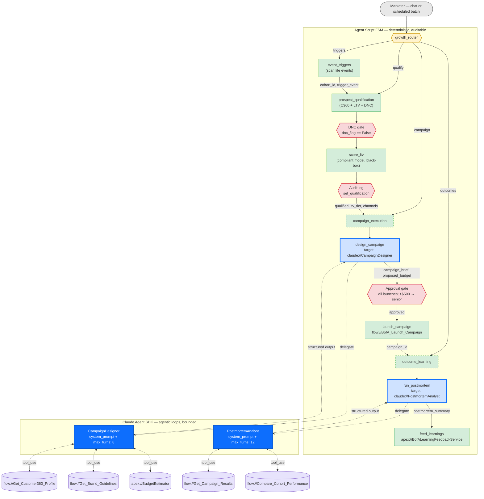

# Hybrid Agent Script + Claude Agent SDK Nodes
### Executive briefing — BofA Growth Engine case study

---

## 1. Context

Bank of America's Growth Engine is an internal marketer-facing agent that runs the consumer-acquisition funnel: detect life-event triggers → qualify high-LTV prospects → design and launch personalized campaigns → analyze outcomes and feed learnings back. It is built today as an Agentforce **Agent Script** finite-state machine.

Agent Script's strength is **determinism**: typed variables, hard `available when` guards, explicit `if`/`transition` routing. For a bank, that determinism is the audit boundary — DNC checks, fair-lending compliance, and approval gates are enforced in code, not in prompts. Its limitation is that each topic gets **one LLM shot per turn** with a fixed tool list. Work that benefits from multi-step research, drafting, and revision (campaign design, post-mortem analysis) is squeezed into a single prompt-template call.

The proposal: introduce a new Agent Script action target, `claude://`, that delegates a single node to a **Claude Agent SDK agentic loop** — keeping the FSM as the audit boundary while letting selected nodes reason iteratively.

---

## 2. Concept mapping

The vocabulary already lines up one-to-one:

| Agent Script | Claude Agent SDK |
|---|---|
| `actions:` (Level-1 defs with `flow://` / `apex://` targets) | `@tool` functions — identical I/O schema, auto-translated |
| `topic` `system:` + `instructions:` | `system_prompt` |
| `variables:` (mutable state) | conversation state dict |
| `reasoning:` (one LLM shot, fixed tools) | **agentic loop** (multi-turn `tool_use` until done) |
| action `inputs:` / `outputs:` | tool `input_schema` / structured return |

A prototype transpiler (`agentscript_to_sdk.py`) already converts a *whole* agent. The hybrid model is more surgical: the FSM stays; individual actions delegate.

---

## 3. The BofA node graph



**Legend**

| Style | Meaning |
|---|---|
| Green solid | Deterministic Agent Script node — stays as-is |
| Green dashed border | Hybrid topic — FSM shell, delegates one action to SDK |
| Red hexagon | Compliance gate — hard-enforced by FSM, never delegated |
| Blue thick border | `claude://` action invocation — the new node type |
| Blue filled | Claude Agent SDK loop running inside the boundary |
| Purple cylinder | Flow/Apex exposed to the SDK loop as a tool |

---

## 4. Which nodes convert — and which must not

| Node | SDK fit | Rationale |
|---|---|---|
| **`design_campaign`** (in `campaign_execution`) | **Highest** | Today a single `prompt://` call. Real campaign design is iterative: pull the prospect's C360 signals, draft creative, check brand and UDAAP guidelines, estimate budget, revise. An SDK loop with those Flows as tools can iterate to a strong brief instead of one-shotting it. |
| **`run_postmortem`** (in `outcome_learning`) | **High** | Pattern-finding across campaign data is open-ended research. An SDK loop can query results, form a hypothesis, query again to test it, then synthesize — the canonical agentic-loop use case. |
| `prospect_qualification` | **Low — keep deterministic** | Intentionally a fixed pipeline (profile → DNC → LTV → audit). Determinism *is the feature*: fair-lending auditability requires "we ran exactly these steps, in this order, every time." |
| `event_triggers` | **Lowest — keep deterministic** | A data lookup. No reasoning to improve. |
| DNC gate, approval gate, audit log, `launch_campaign` | **Never** | These are the regulatory boundary. The SDK node can produce a *brief*; it cannot *launch*. |

---

## 5. Proposed Agent Script syntax

A new target protocol alongside `flow://`, `apex://`, `prompt://`:

```
actions:
	design_campaign:
		description: "Iteratively design a personalized acquisition campaign brief"
		target: "claude://CampaignDesignerAgent"
		tools:
			- "flow://BofA_Get_Customer360_Profile"
			- "flow://BofA_Get_Brand_Guidelines"
			- "apex://BudgetEstimator"
		max_turns: 8
		inputs:
			prospect_id: string
			ltv_tier: string
			trigger_event: string
		outputs:
			campaign_brief: string
			proposed_budget: object
				complex_data_type_name: "lightning__numberType"
```

**Runtime behavior:** Agentforce passes `inputs` to a Claude Agent SDK loop whose tool set is the listed Flows/Apex (schemas auto-translated from their input/output variables). The loop runs until it emits a structured result matching `outputs:` or hits `max_turns`. The result returns to the parent FSM exactly as a Flow result would — the approval gate, $500 check, and launch action all stay deterministic.

---

## 6. Why this matters

This gives regulated enterprises **determinism where it's mandatory and agentic sophistication where it's valuable**:

- **The FSM remains the audit surface.** Every `claude://` node has typed I/O, a turn cap, and an explicit tool allow-list. Compliance reviews "what can this node touch" the same way they review a Flow today.
- **No new trust boundary.** The SDK loop's tools *are* existing Flows and Apex — same permission model, same field-level security, same data residency.
- **Incremental adoption.** Swap one `prompt://` target for `claude://` without touching the rest of the agent. Roll back by reverting one line.
- **Quality ceiling lifts.** Campaign briefs and post-mortems go from one-shot template fills to genuine multi-step reasoning — the difference between a mail-merge and a strategist.

**Recommended v1:** convert `design_campaign` and `run_postmortem`. Everything else stays as-is.

---

## 7. Technical audit — grounded against the real SDK

Audited against `claude-agent-sdk` v0.1.39 (installed). Every claim in §2–§5 maps to a concrete SDK primitive.

### 7.1 The `claude://` node IS an `AgentDefinition`

The SDK already ships the exact data structure a `claude://` target needs:

```python
@dataclass
class AgentDefinition:          # claude_agent_sdk.types
    description: str            # ← Agent Script action `description:`
    prompt: str                 # ← system prompt for this node
    tools: list[str] | None     # ← the `tools:` allow-list
    model: Literal['sonnet', 'opus', 'haiku', 'inherit'] | None
```

And `ClaudeAgentOptions` accepts a **registry** of them:

```python
@dataclass
class ClaudeAgentOptions:
    system_prompt: str | None
    mcp_servers: dict[str, McpSdkServerConfig]   # ← where Flow/Apex tool wrappers live
    allowed_tools: list[str]                     # ← Agent Script `tools:` list
    max_turns: int | None                        # ← proposed `max_turns:` — confirmed real
    max_budget_usd: float | None                 # ← cost guardrail per node (add to spec)
    can_use_tool: Callable[...] | None           # ← runtime equiv of `available when`
    hooks: dict[HookEvent, list[HookMatcher]]    # ← PreToolUse / PostToolUse compliance hooks
    agents: dict[str, AgentDefinition] | None    # ← all claude:// nodes registered here
    output_format: dict | None                   # ← structured outputs: schema enforcement
```

**Implication:** Agentforce's runtime instantiates **one** `ClaudeAgentOptions` per agent, registers every `claude://Name` target as an entry in `agents={"CampaignDesigner": AgentDefinition(...), "PostmortemAnalyst": AgentDefinition(...)}`, and invokes each by name. No per-node process; one SDK client serves all `claude://` nodes in the FSM.

### 7.2 Flows/Apex → tools: the exact mechanism

```python
@tool(name, description, input_schema)  # claude_agent_sdk.__init__:90
async def handler(args: dict) -> dict:
    return {"content": [{"type": "text", "text": ...}]}

server = create_sdk_mcp_server(name="agentforce_actions", tools=[...])
```

`create_sdk_mcp_server` builds an **in-process** MCP server (no subprocess, no IPC). Each Flow/Apex listed under a `claude://` node's `tools:` becomes one `@tool` whose handler calls the existing Agentforce action-invocation REST endpoint (`/services/data/vXX.0/actions/custom/flow/<ApiName>`). The `input_schema` is generated from the Flow's input variables — the same metadata `adlc-scaffold` already reads.

So `tools: ["flow://BofA_Get_Customer360_Profile"]` is not hand-waving: it's a one-line wrapper per Flow, auto-generated, same auth context, same FLS.

### 7.3 Stronger than the original briefing claimed

| SDK primitive | What it gives BofA |
|---|---|
| `hooks` (PreToolUse / PostToolUse) | Compliance checks run **inside** the agentic loop on every tool call, not just at the FSM boundary. E.g., a PreToolUse hook can re-check DNC status before *any* tool touches a prospect_id — even mid-loop. |
| `can_use_tool` callback | Dynamic, per-call equivalent of `available when`. The FSM's variable state (`dnc_flag`, `approval_status`) can gate tool calls inside the SDK loop in real time. |
| `max_budget_usd` | Per-node cost cap. "CampaignDesigner may spend ≤ $0.50/run" is a config field, not a hope. |
| `output_format` | Structured-output enforcement. The SDK validates the loop's final answer against the `outputs:` schema before returning to the FSM — no parse-and-pray. |
| `agents` registry | All `claude://` nodes share one client. The SDK's own subagent mechanism means a `claude://` node can itself spawn helpers (e.g., CampaignDesigner spawns a copy-reviewer) without leaving the sandbox. |

### 7.4 Corrections to the prototype

The existing `agentscript_to_sdk.py` transpiler emits handlers with the **wrong signature**:

```python
# generated (examples/order_support_agent.py:11) — WRONG
async def LookupOrder(order_id: str):
    raise NotImplementedError
```

The SDK contract (`__init__.py:138`) requires `async def handler(args: dict) -> {"content": [...]}`. This must be fixed before the transpiler is load-bearing.

### 7.5 Revised `claude://` syntax — aligned to SDK fields

```
actions:
	design_campaign:
		description: "Iteratively design a personalized acquisition campaign brief"
		target: "claude://CampaignDesigner"
		model: "sonnet"
		max_turns: 8
		max_budget_usd: 0.50
		tools:
			- "flow://BofA_Get_Customer360_Profile"
			- "flow://BofA_Get_Brand_Guidelines"
			- "apex://BudgetEstimator"
		hooks:
			pre_tool_use: "apex://BofAComplianceGuard"
		inputs:
			prospect_id: string
			ltv_tier: string
			trigger_event: string
		outputs:
			campaign_brief: string
			proposed_budget: object
				complex_data_type_name: "lightning__numberType"
```

Every field above maps 1:1 to a `ClaudeAgentOptions` / `AgentDefinition` attribute. Nothing here is speculative.

---

## Appendix — reference implementation

- `force-app/main/default/aiAuthoringBundles/BofAGrowthEngine/BofAGrowthEngine.agent` — the full Agent Script FSM (486 lines, validated)
- `agentscript_agent_sdk_conversion/agentscript_to_sdk.py` — prototype transpiler (needs handler-signature fix per §7.4)
- `claude_agent_sdk` v0.1.39 — `ClaudeAgentOptions`, `AgentDefinition`, `@tool`, `create_sdk_mcp_server` are the four primitives the `claude://` runtime needs
