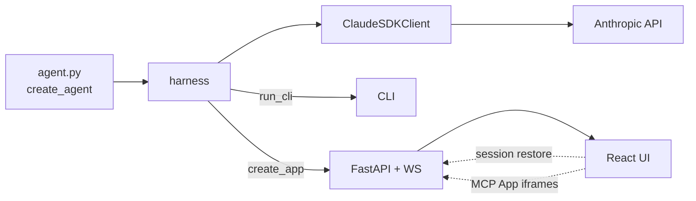

# create-claude-agent

Production-ready boilerplate for building agents with the [Claude Agent SDK](https://docs.anthropic.com/en/docs/agents-and-tools/agent-sdk/overview). Clone this repo, edit one file (`examples/personal-claude/agent.py`), and get a CLI, a FastAPI backend, and a React UI with session management, sandbox isolation, and rich tool rendering — all for free.

## Quick Start

```bash
# 1. Clone and install
git clone <this-repo>
cd create-agent-sdk-app
cp .env.example .env   # Add your ANTHROPIC_API_KEY

# 2. Run in dev mode (hot reload — auto-installs deps)
./run_dev.sh

# 3. Open http://localhost:3001
```

## Architecture



- **`examples/personal-claude/agent.py`** — the file you edit. Defines `create_agent() -> ClaudeAgentOptions`. Ships with MCP tools, MCP Apps, subagents, skills, and hooks already wired.
- **`harness/`** — the reusable library. Owns the SDK client lifecycle, sandbox, serialization, session storage, MCP Apps discovery.
- **`ui/`** — React frontend. Session list, message streaming, tool panels, subagent views.

## The Agent Factory

Your agent is one function that returns `ClaudeAgentOptions`. The harness calls it once per session.

```python
# agent.py
from claude_agent_sdk import ClaudeAgentOptions

def create_agent() -> ClaudeAgentOptions:
    return ClaudeAgentOptions(
        system_prompt="You are a helpful assistant.",
        model="claude-sonnet-4-6",
        allowed_tools=["Write", "Read"],
        permission_mode="bypassPermissions",
    )
```

That's the whole contract. See `harness/types.py:9` for the type definition.

## Sandbox

The harness automatically applies file-write restrictions to your agent via `PreToolUse` hooks. Every session gets its own `sessions/<id>/sandbox/` directory — the agent can only `Write`/`Edit` inside it.

You don't configure this. It's applied by `harness.sandbox.apply_sandbox()` when the harness wraps your factory. Sandbox files show up in the UI's **Artifacts** panel.

## MCP Apps — Rich Tool Rendering

Tools can declare HTML dashboards that the UI renders inline with tool results. The wiring uses the standard MCP protocol (`_meta.ui.resourceUri` + `resources/*`), so no SDK patches are needed.

```python
from harness.mcp_apps import register_mcp_app_resource

todos_server = create_sdk_mcp_server(name="todos", tools=[add_todo, list_todos])

register_mcp_app_resource(
    todos_server,
    tool_name="list_todos",
    html=Path("apps/todo_dashboard.html").read_text(),
)
```

The HTML app implements a simple `postMessage` protocol (JSON-RPC 2.0) — see `examples/personal-claude/apps/todo_dashboard.html` for a working example. Tools without an MCP App fall back to a `<pre>` block.

## Session Management

Each session lives in `sessions/<session_id>/`:

```
sessions/session_20260228_143022/
├── metadata.json      # title, sdk_session_id, cost, turn count
├── messages.jsonl     # WS wire-format payloads (for UI restore)
└── sandbox/           # Agent's writable workspace
```

**Restore works two ways:**
1. The SDK resumes conversation state via `options.resume = sdk_session_id`
2. The harness replays `messages.jsonl` into the UI so the full conversation repaints (including subagent panels and MCP App iframes)

Click an old session in the sidebar → see everything exactly as it was streamed.

## Production

```bash
# Build and run with Docker
docker build -t my-agent .
docker run -p 8000:8000 --env-file .env my-agent

# Use a different example
docker build --build-arg EXAMPLE=claude-consultant -t my-agent .
```

Open `http://localhost:8000`. The container builds the UI, installs Python deps, and serves everything on a single port.

For real deployments, put it behind nginx/caddy with TLS.

### Kubernetes (GKE)

For a full hosted deployment with pod-per-session isolation, egress control, and a pre-warmed pod pool, see [`deploy/kubernetes/`](deploy/kubernetes/README.md). One command provisions a GKE cluster and deploys everything:

```bash
cd deploy/kubernetes
EXAMPLE=personal-claude ./deploy.sh
```

## Extending

**Add a tool:** Define a `@tool`-decorated async function, pass it to `create_sdk_mcp_server`, add `mcp__<server>__<tool>` to `allowed_tools`.

**Add a subagent:** Add an `AgentDefinition` to the `agents` dict. The UI shows subagent messages in a side panel (tracked via `parent_tool_use_id`).

**Add an MCP App:** Write an HTML file implementing the `ui/initialize` → `ui/notifications/initialized` → `ui/notifications/tool-result` handshake, then call `register_mcp_app_resource`.

**Add a remote MCP server:** Set `mcp_servers={"name": {"type": "stdio", "command": "...", "args": [...]}}` — the harness passes this through to the SDK unchanged.

## Reference

| File | Purpose |
|---|---|
| `examples/personal-claude/agent.py` | Agent factory (edit this) |
| `examples/personal-claude/tools.py` | MCP tool implementations |
| `examples/personal-claude/server.py` / `cli.py` | Thin entry-point wrappers |
| `harness/types.py` | `AgentFactory` type |
| `harness/sandbox.py` | PreToolUse hooks for file-write isolation |
| `harness/session.py` | `SessionStore` — metadata + message log |
| `harness/serialization.py` | SDK message → WS payload |
| `harness/mcp_apps.py` | MCP server introspection + resource registration |
| `harness/websocket.py` | `AgentSession` — SDK client lifecycle, WS-agnostic |
| `harness/server.py` | FastAPI `create_app()` + REST routes |
| `harness/cli.py` | `run_cli()` interactive loop |
| `harness/transcript.py` | Symlink SDK's native JSONL into session dir |
